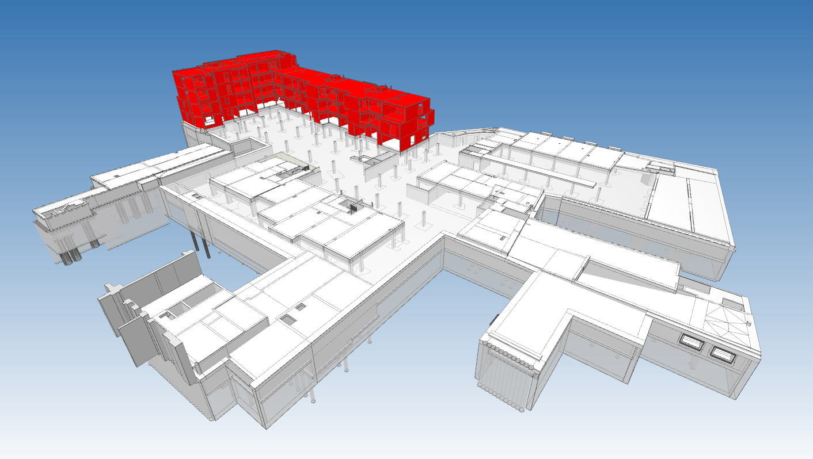
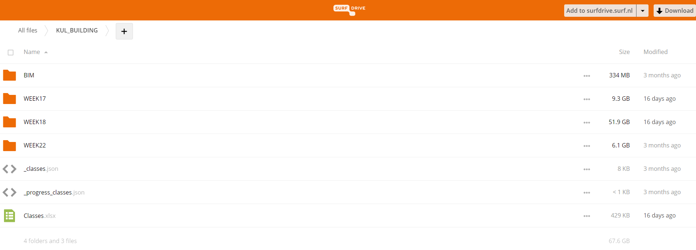

## [DOWNLOAD](https://surfdrive.surf.nl/files/index.php/s/BCUtjn2hZ06hPt4/authenticate)

The KU Leuven (KUL) dataset targets a residential complex. The site (100m x 60m) is comprised of an underground parking and three apartment buildings. The documentation only includes the parking (PRK) and one of the appartments (BUH).

## BIM

The IFC models contain the structure phase of the construction process. This includes structural elements such as slabs, walls, staircases and so on. In total 2621 elements are present.

        <video style="width: 100%;" controls autoplay muted>
            <source src="../assets/video/KUL_small.mp4" type="video/mp4">
            Your browser does not support the video tag.
        </video>

There are some problems for the recording of the BIM.

    

    

Discuss the different files that are present

## Close-range sensing Data

The site was document two-weekly for a total of 17 measurement epochs.

A combination of UAV flights (DJI phantom 4), Lidar measurements (LeicaP30 and BLK) and handheld-images (CANON EOS 5D MarkII) were captured.

Here is an overview of the data that we captured.

For the laser scanning, we used a Leica BLK and Leica P30. In total, some 300 scans were taken of the site in 8 of the epochs. To keep the data manageble, it is subsampled with a resolution of 1cm and stored in blocks of circa 1GB in las files. These files can be easly read in [CLOUDCOMPARE](https://www.danielgm.net/cc/) or in Python using [LASPY](https://laspy.readthedocs.io/en/latest/) (this API is also embedded in [GEOMAPI](https://geomatics.pages.gitlab.kuleuven.be/research-projects/geomapi/) as a dependency).

        <video style="width: 100%;" controls autoplay muted>            <source src="../assets/video/KUL-TLS-small.mp4" type="video/mp4">            Your browser does not support the video tag.        </video>

Say something about UAV photogrammetry

        <video style="width: 100%;" controls autoplay muted>            <source src="../assets/video/KUL-UAV-small.mp4" type="video/mp4">            Your browser does not support the video tag.        </video>

Say something about hand-held photogrammetry

        <video style="width: 100%;" controls autoplay muted>            <source src="../assets/video/KUL-IMG-small.mp4" type="video/mp4">            Your browser does not support the video tag.        </video>

## DOWNLOAD

The link at the top of the page takes you directly to the download page. All the data of both Buildings can be seperately download. The file structure is as follows.

Put a video here that goes through the files:

And here some code to help you parse the data:
