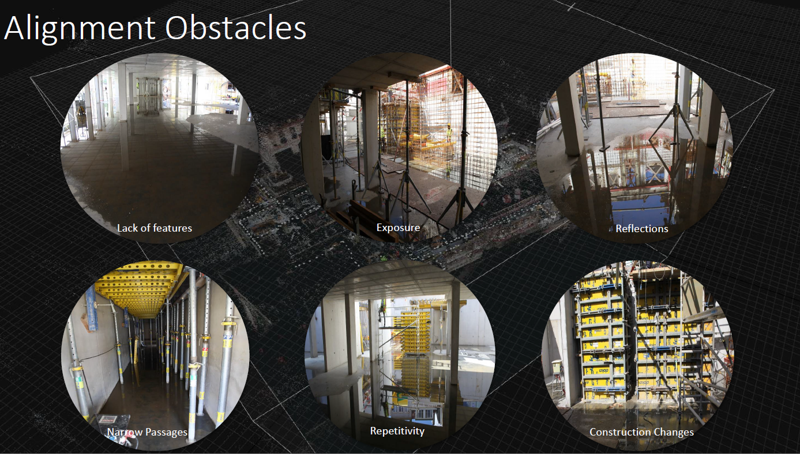

Did you know we were only able to align 65% of the imagery on the Construction sites using commercial software ([MetaShape](https://www.agisoft.com/) and [RealityCapture](https://www.capturingreality.com/))? This is not so surprising if you know the many obstacles [**Structure-from-Motion**](https://en.wikipedia.org/wiki/Structure_from_motion) have to overcome to allign the imagery below.



In this competition, we want to spark innovation for more robust alignment procedures. This includes both the interior and exterior camera parameters. As an example, you can take a look at what information is stored from a software like [RealityCapture](https://www.capturingreality.com/)


Given these parameters, we can accurately position the camera sensors in the construction cordinate system. Using the [GEOMAPI](https://https://geomatics.pages.gitlab.kuleuven.be/research-projects/geomapi/) API, we can easily import some imagery and point clouds (take a look at our website for more examples).

```
import geomapi
from geomapi import tools as tl
from geomapi.utils import geometryutils as gmu

imgNodes=tl.xml_to_nodes(path_to_metashape_xml)

las= laspy.read(las_path)
pcdNode=PointCloudNode(name='myPointCloud', resource=gmu.las_to_pcd(las))
```

And we can visualize these resources using Open3D and some placeholder geometries for the imagery. Note that merging geometries before sending them to the visualizer significantly speeds up the rendering.

```
joinedImages=gmu.join_geometries([gmu.generate_visual_cone_from_image(n.cartesianTransform, height =1).paint_uniform_color([1,0,0]) for n in imgNodes])
o3d.visualization.draw_geometries([joinedImages]+[pcdNode.resource])
```

Now the [COMPETITION](https://paperswithcode.com/datasets) is to align as many of the resources as possible. All you have to do is report your percentage of properly aligned imagery on the complete dataset.


