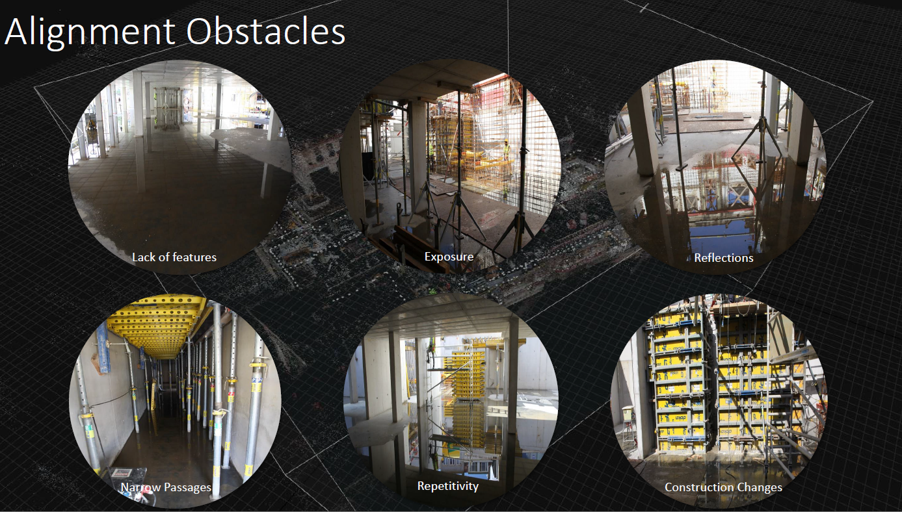
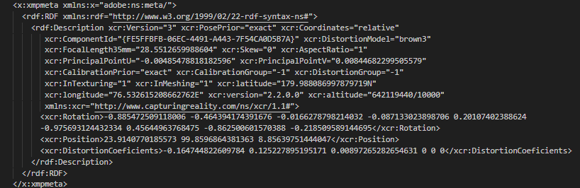

Did you know only 65% of the imagery on a Construction site gets aligned using commercial software? This is not so surprising if you know the many obstacles [**Structure-from-Motion**](https://en.wikipedia.org/wiki/Structure_from_motion) have to overcome to allign the imagery below.



In this competition, we want to spark innovation for more robust alignment procedures. This includes both the interior and exterior camera parameters. As an example, you can take a look at what information is stored from a software like [RealityCapture](https://www.capturingreality.com/)



Given these parameters, we can accurately position the camera sensors in the construction cordinate system. Using the [GEOMAPI ](https://)API

```

```

If we then also undistort the imagery, we can ray

At the heart of the struggle are two very different ideas of success—survival-driven and soul-driven. For survivalists, success is security, pragmatism, power over others. Success is the absence of material suffering, the nourishing of the soul be damned. It is an odd and ironic thing that most of the material power in our world often resides in the hands of younger souls. Still working in the egoic and material realms, they love the sensations of power and focus most of their energy on accumulation. Older souls tend not to be as materially driven. They have already played the worldly game in previous lives and they search for more subtle shades of meaning in this one—authentication rather than accumulation. They are often ignored by the culture at large, although they really are the truest warriors.

A soulful notion of success rests on the actualization of our innate image. Success is simply the completion of a soul step, however unsightly it may be. We have finished what we started when the lesson is learned. What a fear-based culture calls a wonderful opportunity may be fruitless and misguided for the soul. Staying in a passionless relationship may satisfy our need for comfort, but it may stifle the soul. Becoming a famous lawyer is only worthwhile if the soul demands it. It is an essential failure if you are called to be a monastic this time around. If you need to explore and abandon ten careers in order to stretch your soul toward its innate image, then so be it. Flake it till you make it.

