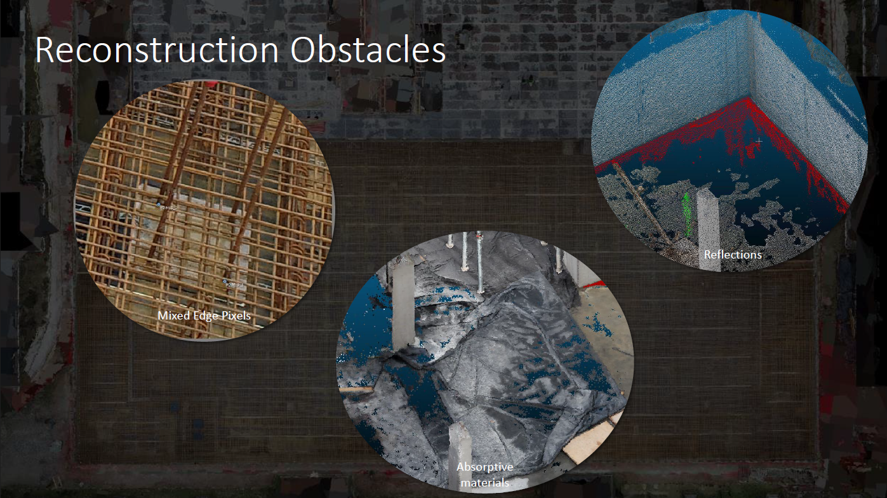
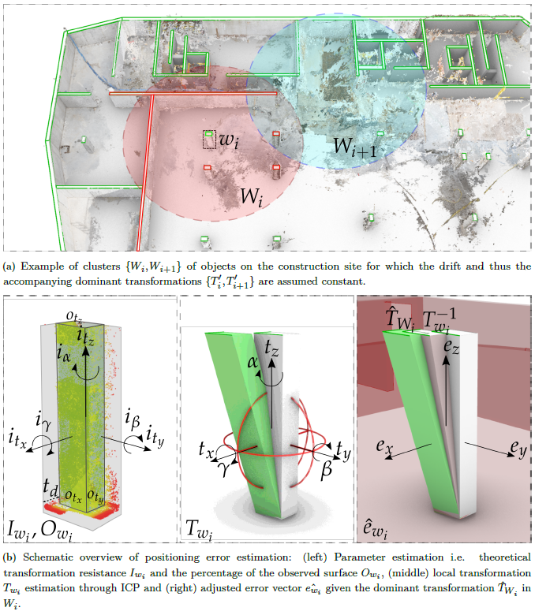
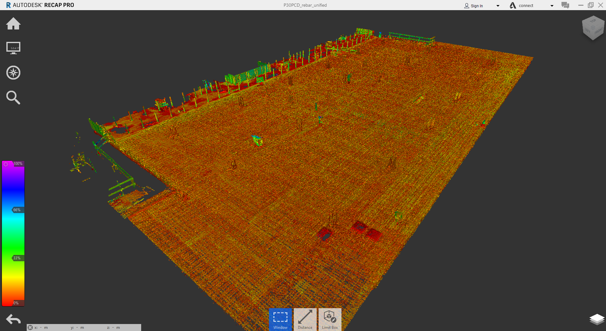
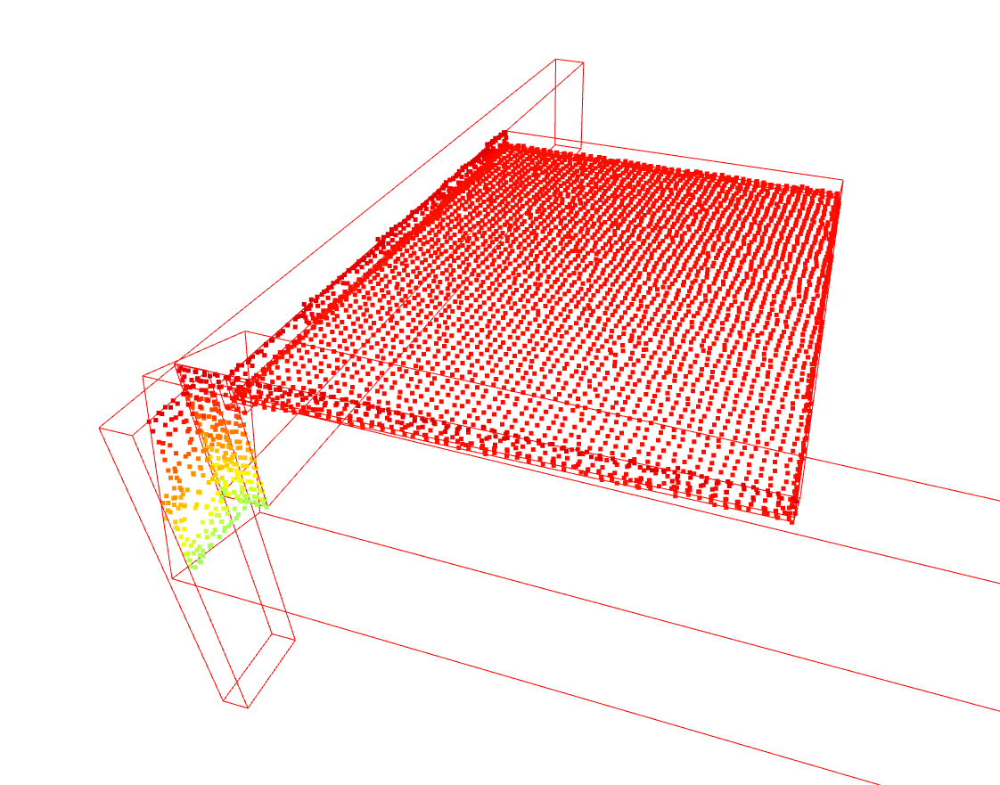

## [COMPETITION](https://paperswithcode.com/datasets)

Current [Structure-from-Motion](https://en.wikipedia.org/wiki/Structure_from_motion) pipelines and even laser scanning measurements struggle to accurately reconstruct key scenarios in construction sites such as rebar fields, absorptive materials and so on.

Furthermore, there is still a gap between SfM and LS methods of on average 1-3cm. To provide sufficient confidence and provide opposable results in documentation procedures, reconstruction methods must improve and their results must become consistent.

In this competition, we want to spark innovation for the improvement of reconstruction pipelines on constructions sites. This includes the accuracy of the placement of the elements and point deviations, noise and the coverage on objects.

### Accuracy

Presented methods can report accuracy as the RMSE [m] values between the BIM surfaces and their best fit counterparts in the point clouds. This effectively measures the spread of the data on surfaces in the BIM and their positional changes.  Only Structural Elements will be evalued in this competition.

### Noise

Presented methods can report noise as the percentage of stray points that are not within 1cm of the intended object. We will propose some regions where there is alot of noise but authors can freely choose other regions to see if their method improves the reconstruction.

### Completeness

Presented methods can report completeness as the percentage of the surface area of BIM objects that is reconstructed by the close-range observation processes.

