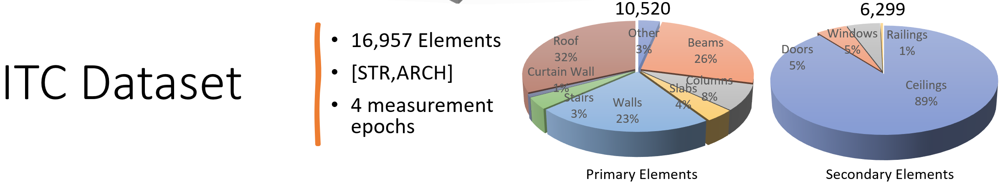
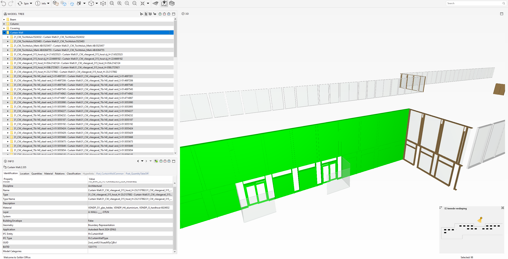
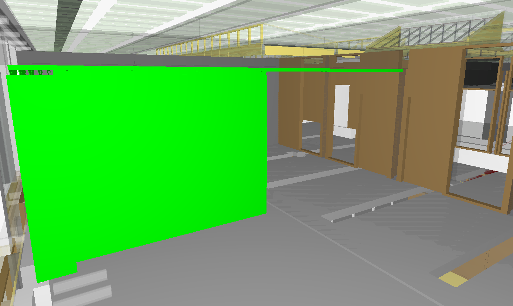
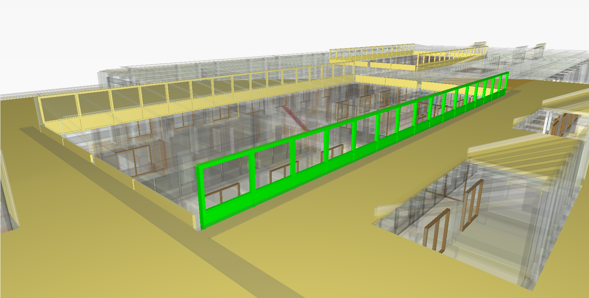

## [DOWNLOAD (TO BE RELEASED)](https://surfdrive.surf.nl/files/index.php/s/BCUtjn2hZ06hPt4/authenticate)

The Utwente (ITC) dataset targets a Educational facility. The site (200m x 40m) is comprised of a two-storey building constructed on top of an existing concrete structure. The documentation comprises four key stages of the construction i.e. stripped structure, completed structure phase, completed architecture phase and the final building.

## BIM

The IFC model contains the structure and architectural elements of the construction. The initial model contained 51776 elements, including a significant amount of elements that are invisible during the monitoring. Therefore, and for practicallity reasons, the models was purified to only contain elements relevant to the detection from close-range sensing observations. As such the model now contains **16.957 elements** including:

        <video style="width: 100%;" controls autoplay muted>
            <source src="../assets/video/ITC_small.mp4" type="video/mp4">
            Your browser does not support the video tag.
        </video>

Sepcial about this construction is the use of **Curtain Walls**, which can pose quite a challenge to detection algorithms as they share significant detection signatures with Windows, Door and Walls. For simplicity sake, only exterior elements were classified as Curtain Walls, while interior Curtain Walls were altered to Windows, Doors and Walls based on their functionality.

    

Doors and Windows also have some interesting characteristics. For instance, **moveable panels are classified as Doors **as they function as transfer elements from one space to the next. Similarly, several **windows are atypical** and share geometries similar to walls.

    

    

Other difficulties include th numerous elements that are used to model to staircases. For instance, each step in the staircases was modelled as  a separate element, making its detection cumbersome.

## Close-range sensing Data

The site was documented at four key stages. A combination of UAV flights (XXX), Lidar measurements (SLAM and TLS) and handheld smartphone footage was captured.

For the laser scanning, we used a XXX and XXX. In total, some 300 scans were taken of the site in 8 of the epochs. To keep the data manageble, it is subsampled with a resolution of 1cm and stored in blocks of circa 1GB in las files. These files can be easly read in [CLOUDCOMPARE](https://www.danielgm.net/cc/) or in Python using [LASPY](https://laspy.readthedocs.io/en/latest/) (this API is also embedded in [GEOMAPI](https://geomatics.pages.gitlab.kuleuven.be/research-projects/geomapi/) as a dependency).

        <video style="width: 100%;" controls autoplay muted>            <source src="../assets/video/ITC-TLS-small.mp4" type="video/mp4">            Your browser does not support the video tag.        </video>

Say something about iMMs. 

        <video style="width: 100%;" controls autoplay muted>            <source src="../assets/video/ITC-iMMs-small.mp4" type="video/mp4">            Your browser does not support the video tag.        </video>

Say something about UAV / hand-held photogrammetry

        <video style="width: 100%;" controls autoplay muted>            <source src="../assets/videoI/ITC-UAV-small.mp4" type="video/mp4">            Your browser does not support the video tag.        </video>

## [DOWNLOAD (TO BE RELEASED)](https://surfdrive.surf.nl/files/index.php/s/BCUtjn2hZ06hPt4/authenticate) 

The link at the top of the page takes you directly to the download page. All the data of both Buildings can be seperately download. The file structure is as follows.

Put a video here that goes through the files:

And here some code to help you parse the data:

