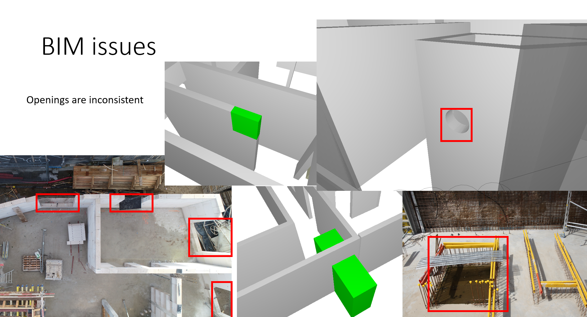
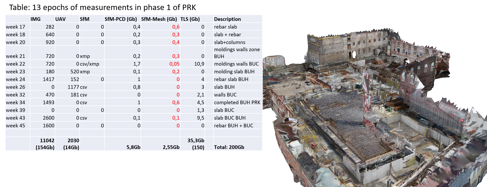

## [DOWNLOAD]()

The KU Leuven (KUL) dataset targets a residential complex. The site (100m x 60m) is comprised of an underground parking and three apartment buildings. The documentation only includes the parking (PRK) and one of the appartments (BUH).

The IFC models contain the structure phase of the construction process. This includes structural elements such as slabs, walls, staircases and so on. In total 2621 elements are present.

<video controls autoplay>        <source src="../assets/video/KUL_small.mp4" type="video/mp4">        Your browser does not support the video tag.    </video>

The site was document two-weekly for a total of 17 measurement epochs. A combination of UAV flights (DJI phantom 4), Lidar measurements (LeicaP30 and BLK) and handheld-images (CANON EOS 5D MarkII) were captured.

<video controls autoplay>        <source src="../assets/video/KUL-TLS.mp4" type="video/mp4">        Your browser does not support the video tag.    </video><video controls autoplay>        <source src="../assets/video/KUL-UAV.mp4" type="video/mp4">        Your browser does not support the video tag.    </video><video controls autoplay>        <source src="../assets/video/KUL-IMG.mp4" type="video/mp4">        Your browser does not support the video tag.    </video>

<head>
    <title>Autoplay Videos and Images Example</title>
    
</head>
<body>
    

        

            <video controls autoplay>
                <source src="KUL-TLS-small.mp4" type="video/mp4">
                Your browser does not support the video tag.
            </video>
        

        

            <video controls autoplay>
                <source src="KUL-UAV-small.mp4" type="video/mp4">
                Your browser does not support the video tag.
            </video>
        

        

            <video controls autoplay>
                <source src="KUL-IMG.mp4" type="video/mp4">
                Your browser does not support the video tag.
            </video>
        

    

</body>

| Class   | Structural Elements |
| :-------- | :-------------------- |
| Beams   | 225                 |
| Columns | 125                 |
| Slabs   | 400                 |
| Walls   | 362                 |
| Stairs  | 5                   |

There are some problems for the recording of the BIM.

<body>
     

        

            
        

        

            
        

    

</body>

Here is an overview of the data that we captured.

